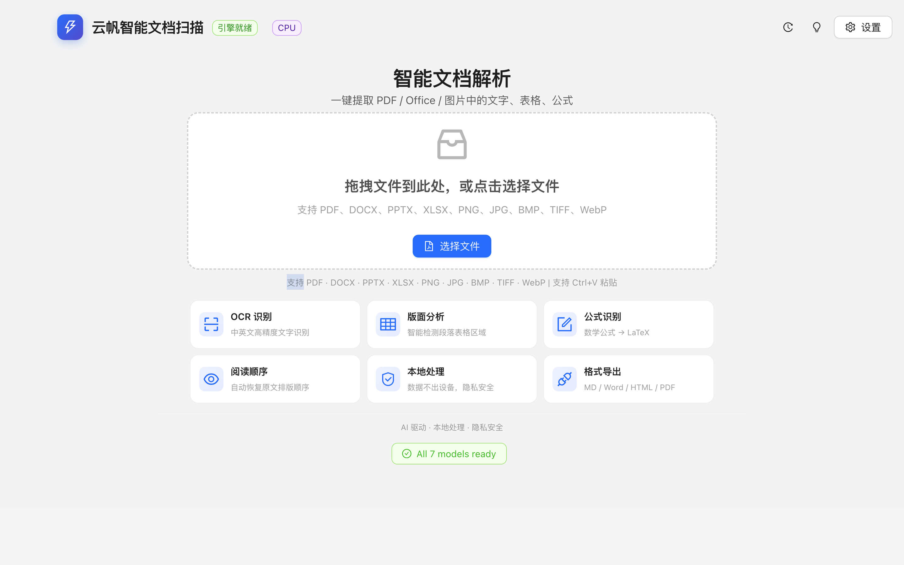
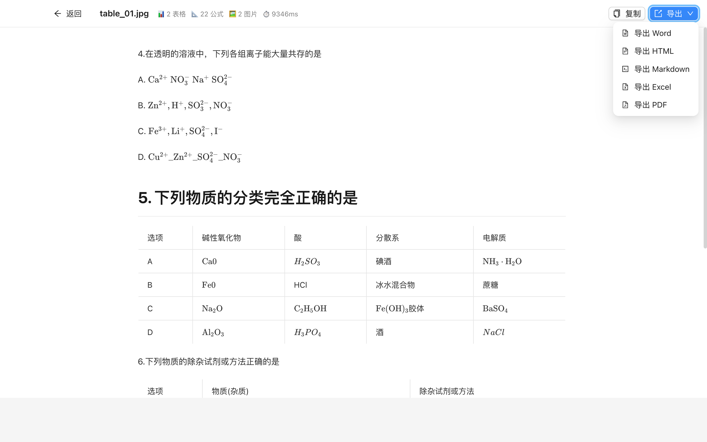
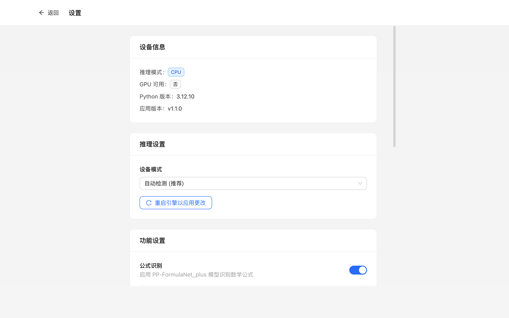
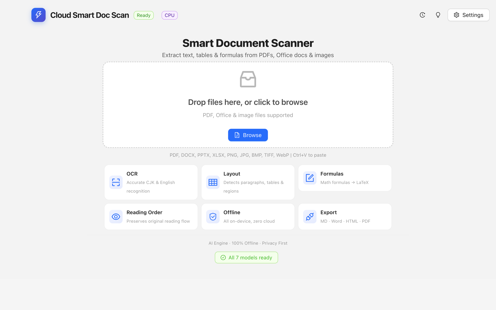
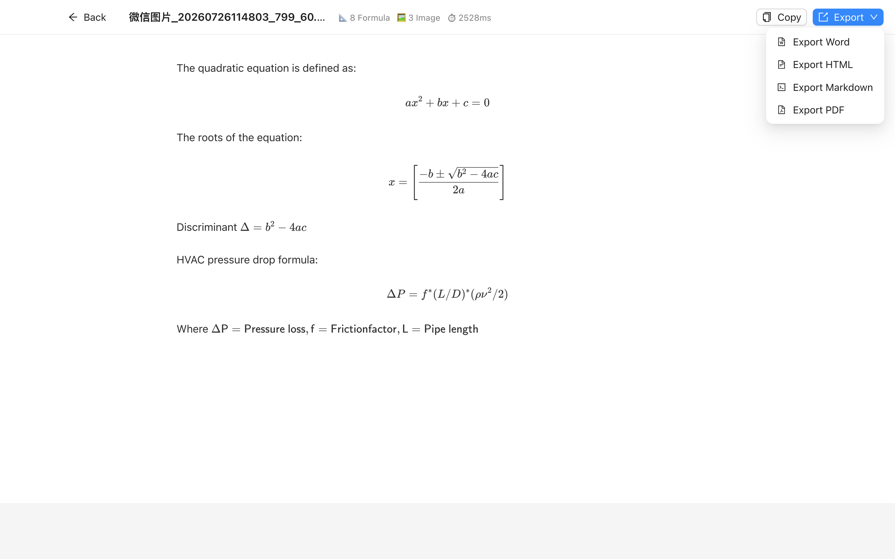
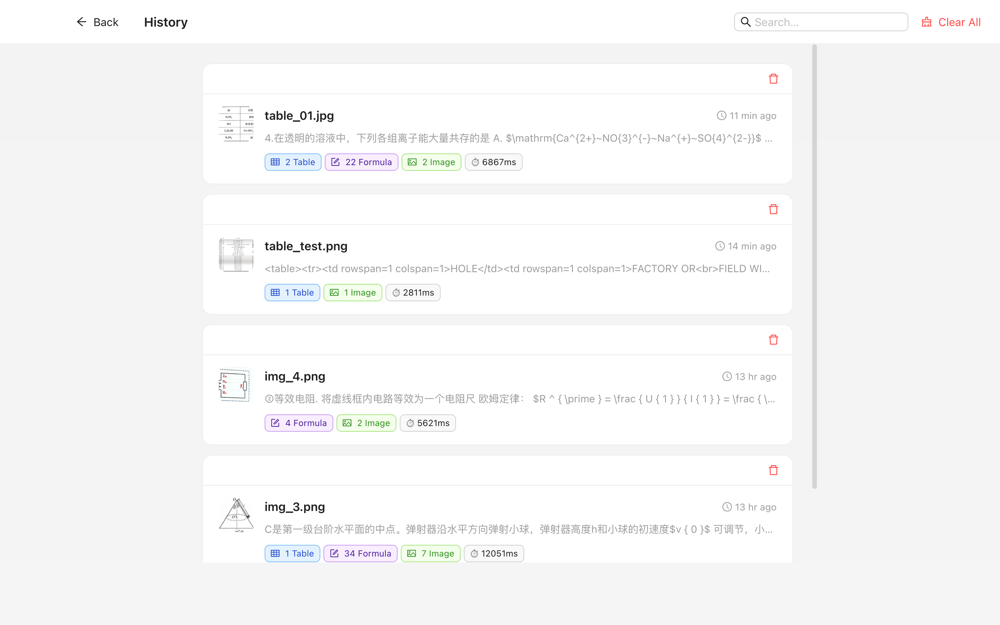

<p align="center">
  <picture>
    <source media="(prefers-color-scheme: dark)" srcset="screenshots/chinese01.png">
    
  </picture>
</p>

<h1 align="center">☁️ 云帆智能文档扫描</h1>
<p align="center">
  <strong>Cloud Smart Doc Scan</strong>
</p>

<p align="center">
  <a href="https://apps.apple.com/app/id待填写"></a>
  &nbsp;
  <a href="https://apps.microsoft.com/store/detail/待填写"></a>
</p>

<p align="center">
  <em>完全离线 AI 文档理解工具 — 拖拽 PDF、图片或 Office 文件，<br>一键识别文字、提取表格与数学公式，导出 Markdown、Word、HTML。<br>支持 50+ 语言，无需联网，隐私安全。免费下载即享 30 天全功能试用。</em>
</p>

<p align="center">
  <a href="#-为什么选择云帆智能文档扫描">为什么选择</a> ·
  <a href="#-下载">下载</a> ·
  <a href="#-快速开始">快速开始</a> ·
  <a href="#-功能特性">功能特性</a> ·
  <a href="#-截屏预览">截屏预览</a> ·
  <a href="#-隐私政策">隐私政策</a> ·
  <a href="#-定价">定价</a>
</p>

---

## 🌟 为什么选择云帆智能文档扫描？

| 对比维度 | 云帆智能文档扫描 | 传统在线 OCR 工具 |
|----------|:---------------:|:-----------------:|
| 🔒 **隐私安全** | ✅ 完全离线，数据不出设备 | ❌ 文件需上传至云端 |
| 🌐 **网络依赖** | ✅ 无需联网即可使用 | ❌ 需要稳定网络连接 |
| 🌍 **多语言** | ✅ 支持 50+ 种语言 | ⚠️ 通常仅支持常见语言 |
| 📊 **表格提取** | ✅ 有线/无线表格均可，导出 Excel | ⚠️ 部分支持，效果参差 |
| 🔢 **公式识别** | ✅ LaTeX 渲染，复杂公式完美输出 | ❌ 多数不支持 |
| 💰 **收费模式** | ✅ 一次性买断 ¥68，永久使用 | ❌ 按月/按量付费 |
| 🧩 **文件格式** | ✅ PDF/Office/图片全支持 | ⚠️ 格式受限 |
| 📤 **导出格式** | ✅ Markdown/Word/HTML/PDF | ⚠️ 通常仅 TXT/PDF |

> 💡 **一句话总结**：不需要联网、不需要上传文件、不需要订阅 — 一次性买断，所有数据留在你的设备上。

---

## 📥 下载

<p align="center">
  <a href="https://apps.apple.com/app/id待填写">
    
  </a>
  &nbsp;&nbsp;
  <a href="https://apps.microsoft.com/store/detail/待填写">
    
  </a>
</p>

| 平台 | 商店 | 价格 |
|------|------|------|
| 🍎 macOS | [Mac App Store](https://apps.apple.com/app/id待填写) | ¥68 / $9.99 / €9.99 |
| 🪟 Windows | [Microsoft Store](https://apps.microsoft.com/store/detail/待填写) | ¥68 / $9.99 / €9.99 |

---

## 🚀 快速开始

1. 从 **Mac App Store** 或 **Microsoft Store** 下载安装（免费，含 30 天全功能试用）
2. 拖入 PDF、扫描件或 Office 文档（DOCX / PPTX / XLSX）
3. AI 即刻完成 OCR 文字识别、版式分析与表格公式提取
4. 一键导出为 **Markdown**、**Word**、**HTML** 或 **PDF**

```
免费下载 App → 自动获得 30 天全功能试用
→ 试用到期后功能受限，提示内购
→ 一次性 ¥68 / $9.99 买断 → 永久解锁完整版 ✅
```

---

## ✨ 功能特性

### 🧠 智能 OCR — 50+ 语言

支持中文简/繁、日文、英文及德、法、西、意等欧洲主流语言。基于 PaddleOCR v6 引擎，利用设备本地 CPU/GPU 推理（macOS 上利用 Apple Silicon 神经引擎加速），识别精度媲美云端服务。

### 📐 版式分析

自动还原段落、标题、表格、图片的排版结构。原文档与 Markdown 输出左右分栏对比，版式高保真还原，阅读顺序智能排序。

### 📊 表格提取

支持有线表格与无线表格自动识别，结构化输出可直接导出 Excel 编辑。复杂跨页表格自动合并，单元格对齐精准还原。

### 🔢 公式识别

数学公式自动识别并转换为 LaTeX 格式，支持行内公式与块级公式，复杂积分、矩阵、化学方程式完美渲染。

### 🔒 隐私至上

- ✅ 所有 AI 处理在设备本地完成，数据从不出设备
- ✅ 不收集任何数据、不含广告、不含任何分析 SDK
- ✅ 仅通过官方商店验证购买（StoreKit / Windows Store），不传输文档数据

---

## 📥 输入 / 📤 输出

| | 支持格式 |
|------|---------|
| 📥 **输入** | PDF · 图片（PNG / JPG / BMP / TIFF / WebP） · Office（DOCX / PPTX / XLSX） |
| 📤 **输出** | Markdown · Word · HTML · PDF |

---

## 📸 截屏预览

### 🇨🇳 中文界面

<p align="center">
  
  <br><sub><strong>拖拽即识别</strong> — 拖拽 PDF 或图片，即拖即识别</sub>
</p>

<p align="center">
  
  <br><sub><strong>AI 版式分析</strong> — 原文档与 Markdown 结果对比，版式高保真还原</sub>
</p>

<p align="center">
  
  <br><sub><strong>表格精准提取 + 公式识别</strong> — 表格导出 Excel，公式自动转 LaTeX</sub>
</p>

### 🇺🇸 English UI

<p align="center">
  
  <br><sub><strong>Drag & Recognize</strong> — Drop a PDF or image for instant OCR</sub>
</p>

<p align="center">
  
  <br><sub><strong>AI Layout Analysis</strong> — Side-by-side comparison with high-fidelity Markdown output</sub>
</p>

<p align="center">
  
  <br><sub><strong>Table Extraction + Formula Recognition</strong> — Export tables to Excel, convert math to LaTeX</sub>
</p>

---

## 🔒 隐私政策

| 平台 | 中文 | English |
|------|------|---------|
| 🍎 macOS | [中文](https://likky.github.io/smartdocscan-privacy/privacy-policy-mac-zh.html) | [English](https://likky.github.io/smartdocscan-privacy/privacy-policy-mac-en.html) |
| 🪟 Windows | [中文](https://likky.github.io/smartdocscan-privacy/privacy-policy.html) | [English](https://likky.github.io/smartdocscan-privacy/privacy-policy.html) |

**核心承诺**：所有文档处理在设备本地完成，数据不会离开你的设备。不收集数据、不含广告、不含任何分析 SDK，从根本上杜绝了传输和云端存储带来的泄露风险。

---

## 💰 定价

| 项目 | 🍎 macOS | 🪟 Windows |
|------|----------|------------|
| **商店** | Mac App Store | Microsoft Store |
| **模式** | 免费下载 + 一次性买断 | 免费下载 + 一次性买断 |
| **价格** | ¥68 / $9.99 / €9.99 | ¥68 / $9.99 / €9.99 |
| **试用** | 30 天全功能免费试用 | 30 天全功能免费试用 |
| **付费** | 一次性买断，永久有效 | 一次性买断，永久有效 |

> 💡 两个平台<strong>价格一致、权益一致</strong>。一次购买仅限当前平台使用。与按月订阅的同类工具相比，不到一年订阅费即可永久使用。

---

## 📋 系统要求

| 项目 | 🍎 macOS | 🪟 Windows |
|------|----------|-----------|
| **系统** | macOS 11.0（Big Sur）+ | Windows 10 22H2+ / Windows 11 |
| **芯片** | Apple Silicon（M1-M4） | x64（Intel / AMD） |
| **内存** | 8 GB+ | 8 GB+ |
| **存储** | 约 2 GB（含 AI 模型） | 约 2 GB（含 AI 模型） |
| **网络** | 无需联网（仅商店验证时） | 无需联网（仅商店验证时） |

---

## 📧 联系我们

如有问题或反馈，欢迎联系：**[tianya1110@gmail.com](mailto:tianya1110@gmail.com)**

---

<p align="center">
  <sub>© 2026 云帆智能文档扫描 · Cloud Smart Doc Scan — 保留所有权利。</sub>
</p>
